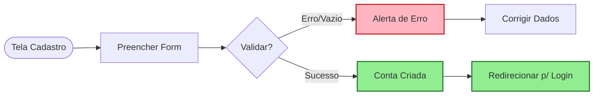
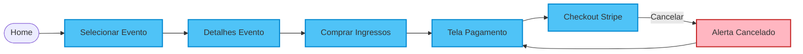
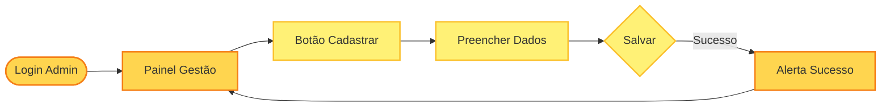

# Documentação dos Testes Automatizados (E2E)

Esta documentação descreve as suítes de testes automatizados implementadas no projeto utilizando o framework **Maestro**.

## 📋 Casos de Teste: Cadastro de Conta

| Identificador do caso de uso | Nome do caso de uso              | Descrição                                                                                     |
| :--------------------------- | :------------------------------- | :-------------------------------------------------------------------------------------------- |
| **UC-02.1**                  | **Caso 1: Campos vazios**        | Tentar criar conta sem preencher nenhum campo obrigatório.                                    |
| **UC-02.2**                  | **Caso 2: Sem Email**            | Tentar criar conta preenchendo nome e senha, mas deixando o email vazio.                      |
| **UC-02.3**                  | **Caso 3: Senha Fraca**          | Tentar criar conta com uma senha curta (menos de 6 caracteres).                               |
| **UC-02.4**                  | **Caso 4: Cadastro com Sucesso** | Preencher todos os dados corretamente (Happy Path) e verificar o redirecionamento para login. |

## 📋 Casos de Teste: Fluxo de Compra

| Identificador do caso de uso | Nome do caso de uso           | Descrição                                                                                                           |
| :--------------------------- | :---------------------------- | :------------------------------------------------------------------------------------------------------------------ |
| **UC-04.1**                  | **Seleção de Evento**         | Logar, selecionar um evento na lista e iniciar o processo de compra.                                                |
| **UC-04.2**                  | **Cancelamento de Pagamento** | Prosseguir para o pagamento, abrir o checkout (Stripe) e cancelar a operação, verificando o alerta de cancelamento. |

## 📋 Casos de Teste: Criação de Evento (Admin)

| Identificador do caso de uso | Nome do caso de uso       | Descrição                                                                                       |
| :--------------------------- | :------------------------ | :---------------------------------------------------------------------------------------------- |
| **UC-03.1**                  | **Acesso Administrativo** | Realizar login com credenciais de administrador e validar acesso ao painel de gestão.           |
| **UC-03.2**                  | **Cadastro de Evento**    | Preencher formulário de novo evento (Nome, Local, Capacidade, Preço) e submeter.                |
| **UC-03.3**                  | **Validação de Sucesso**  | Verificar mensagem de sucesso após cadastro e retorno automático para a lista de gerenciamento. |

